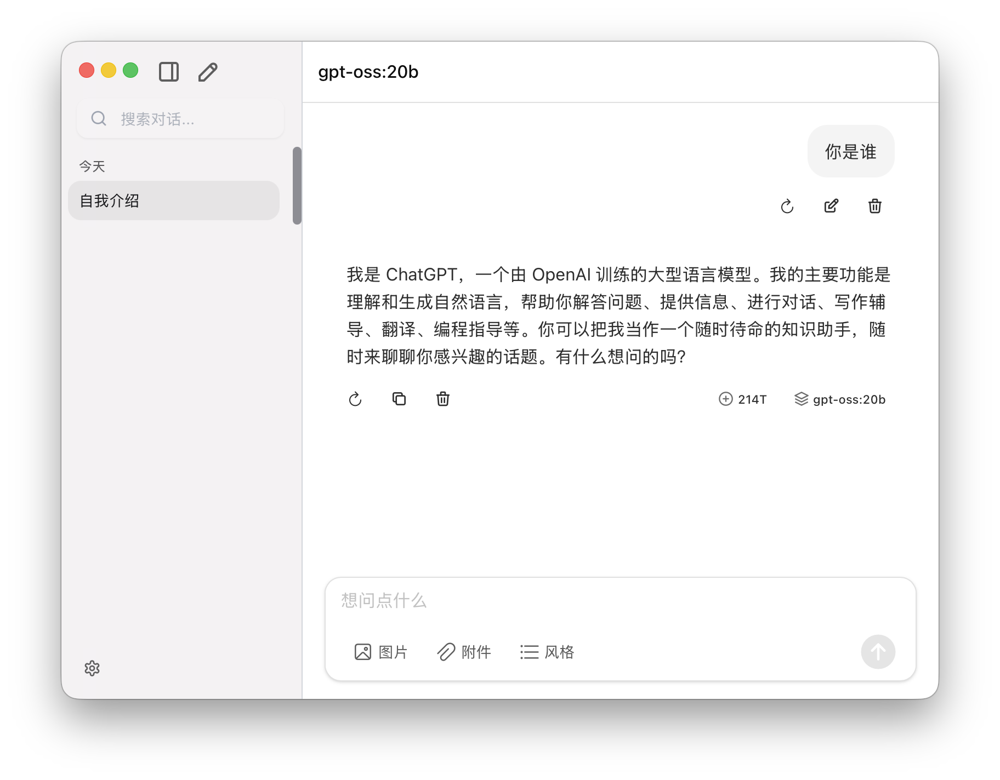

# ChatFlex



ChatFlex 是一个本地优先的桌面 AI 聊天客户端，基于 Tauri 2、Vue 3、TypeScript 和 Vercel AI SDK 构建。

[English](./README.en-US.md) | 简体中文

## 功能

- 支持 OpenAI、Anthropic、Google、DeepSeek、Ollama、OpenRouter、Groq、Together 以及自定义 OpenAI 兼容接口。
- 使用 IndexedDB 本地保存会话、消息、供应商、模型、提示词和工具配置。
- 支持流式响应、Markdown 渲染、图片展示、提示词管理、记忆和数据导出。
- 通过 Tauri 插件提供文件访问、对话框、快捷键、外部打开、日志、HTTP 和可选自动更新能力。

## 开发

```bash
bun install
bun run dev
```

启动桌面壳：

```bash
bun run tauri:dev
```

## 构建

```bash
bun run build
bun run tauri:build
```

## 测试

```bash
bun run test
```

Ollama 集成测试默认跳过。如需在本机运行：

```bash
RUN_OLLAMA_INTEGRATION=true OLLAMA_TEST_MODEL=gpt-oss:latest bun run test
```

## 配置

仅在需要启用可选开发开关时，将 `.env.example` 复制为 `.env`。仓库内不需要包含任何 API Key 或服务凭据。

公开版本默认关闭自动更新。启用前请先配置你自己的更新端点和签名密钥。

## 许可证

MIT
