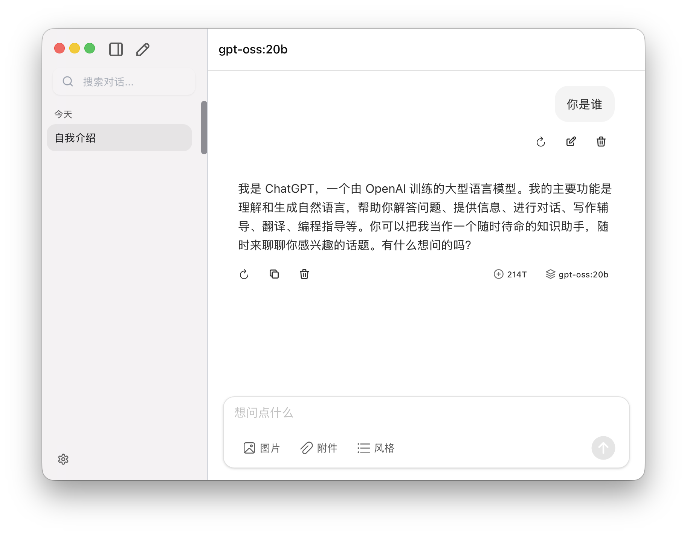

# 🧠 ChatFlex

**一款本地优先的大语言模型桌面界面 —— 为使用 Ollama 等工具的高阶用户而设计。**

[🌐 官网访问](https://www.chatflex.app)

[English](README.md) | 简体中文

## ⚙️ 产品功能

- 🧵 **链式思维提示**（Chain-of-Thought）
- 📄 **Markdown 导出**
- 🖥️ **桌面优先体验**（macOS / Windows）
- 🔌 **多模型支持** —— 可自定义 AI 供应商，不限于 Ollama 默认设置
- 🔐 **完全本地运行** —— 无需后端服务
- 🖼️ **支持上传图片与文档**
- 🔍 **全文会话搜索**

---

## 💡 为什么选择 ChatFlex？

虽然 Ollama 自带了一个基础 UI，但 ChatFlex 提供更高的灵活性与性能，真正适配真实工作流：

| 特性 | ChatFlex | Ollama UI |
|------|----------|-----------|
| 原生支持 Ollama | ✅ | ✅ |
| 自定义 AI 供应商 | ✅ | ❌ |
| 无需后端服务 | ✅ | ✅ |
| 桌面体验优化 | ✅ | 基础 |
| 高性能搜索与导出 | ✅ | ❌ |

---

> 已经在用 Ollama 跑本地模型？ChatFlex 是你的下一步 —— 更清爽的界面、更强的性能、对 AI 堆栈拥有完全控制权。
